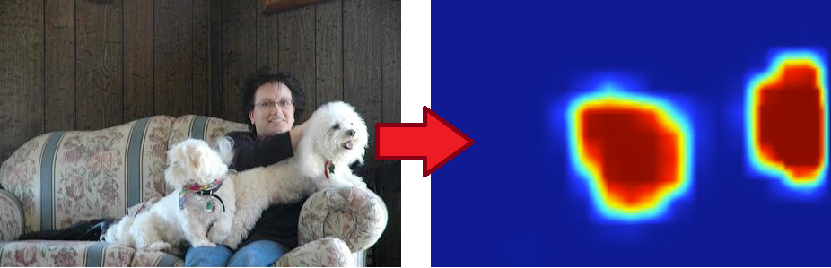

## 01_mnist_mlp.py

### Zadatak

Eksperimentisati sa:

* strukturom neuronske mreže (broj skrivenih slojeva, broj neurona u skrivenom sloju)
* parametrima obučavanja (brzina obučavanja, momentum)
* aktivacionim funkcijama
* brojem elemenata koje SGD uzima u svakoj epohi
* brojem epoha

**Za svaki eksperiment zabeležiti sve gorenavedene parametre i postignutu tačnost**

------

## 02_cifar10_cnn.py

Implementirana CNN za CIFAR10 dataset. Moguće je koristiti težine već obučene CNN učitavanjem fajla *02_cifar10_cnn.hdf5*.

**Napomena:** Ukoliko budete menjali samu arhitekturu CNN, moraćete je ponovo obučiti, tj. neće biti moguće koristiti težine prethodno obučene CNN.

### Zadatak

CIFAR10 CNN radi samo sa 32x32 RGB slikama na kojima se nalazi samo po jedan objekat određene klase (ukupno 10 klasa).
U cilju prepoznavanja više objekata određene klase ili različitih klasa, potrebno je implementirati tzv. "heat-map", odnosno
da se na slici proizvoljne veličine mogu pronaći objekti.

Primer heat mape za klasu *dog* (crvenije/toplije nijanse su indikator većih verovatnoća sa određenu klasu):



Krajni cilj je da, na osnovu dobijene heat mape, na originalnoj slici obeležiti prepoznate objekte.

**Testirati nad slikama** "images/02_\*.jpg"

------

## 03_imdb_cnn.py

Da bi reči recenzija konvertovali u vektor, prvo je neophodno izvršiti tokenizaciju teksta (tekst -> izdvojene reči). Za tokenzaciju korisšćenja je biblioteka NLTK (natural language tokenizer), koja je deo Anaconda okruženja. Za tokenizaciju pomoću NLTK potrebno je skinuti određen korpus tokenizera, odnosno u Python konzoli izvršiti sledeće:

```python
import nltk
nltk.download()
```

Ovo će otvoriti NLTK GUI za download raznih tokenizera, ali za ovaj demo preuzeti samo punkt tokenizator: **Models -> punkt -> download**. Kada je download završen, zatvoriti NLTK GUI.

### Zadatak

* Eksperimentisati sa parametrima i strukturom 1D konvolutivne neuronske mreže u cilju povećanja tačnosti klasifikacije.
* Iskoristiti mrežu za klasifikaciju nad nekim drugim dataset-om.
* Izmeniti mrežu tako da podržava finiju klasifikaciju - ne samo pozitivan/negativan, već i veoma pozitivan/pozitivan/neutralan/negativan/veoma negativan, ili npr. ocene od 1 do 10.

------

## 04_mnist_mlp_autoencoder.py

### Zadatak

* Eksperimentisati sa parametrima autoenkodera u cilju dobijanja što bolje rekonstrukcije ulaza, ali sa što manje neurona u prelaznom sloju (izlaz enkodera i ulaz dekodera).

------
